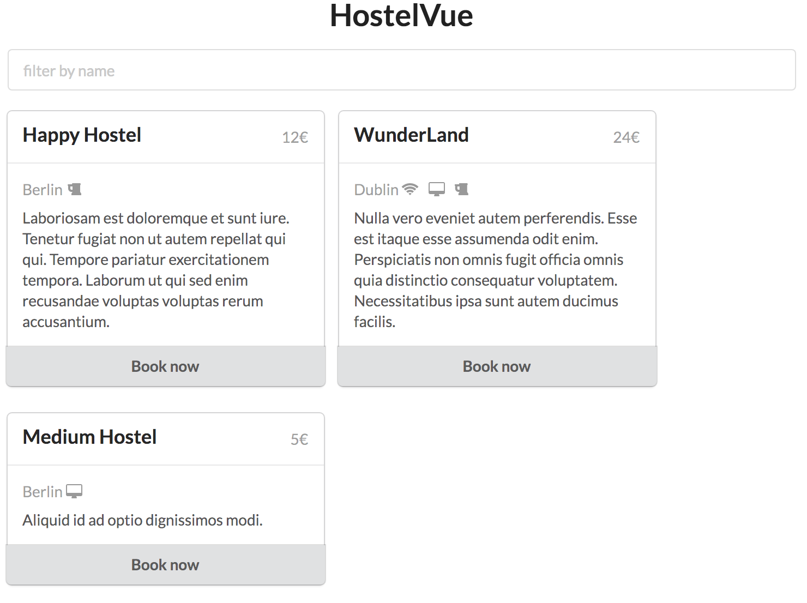

# Part 1: Playing with Vue Syntax

Create an `index.html` in a folder base on the following structure:

```html
<!DOCTYPE html>
<html lang="en">
<head>
  <meta charset="UTF-8">
  <meta name="viewport" content="width=device-width, initial-scale=1.0">
  <meta http-equiv="X-UA-Compatible" content="ie=edge">
  <!-- include Vue.js from a CDN -->
  <script src="https://unpkg.com/vue"></script>
  <!-- include semantic-ui a CSS framework from a CDN -->
  <link rel="stylesheet" href="https://cdnjs.cloudflare.com/ajax/libs/semantic-ui/2.2.13/semantic.min.css">
  <title>HostelVue</title>
</head>
<body>
<div id="app" class="ui container">
  <h1 class="ui center aligned header">HostelVue</h1>
  <div class="ui cards">

    <!-- HTML here -->

  </div>
</div>
<script>
// JS here
</script>
</body>
</html>
```

Our final goal is to create something like this:



## Step 1: rendering data

Print on the web page the informations related to the hostel:
* name
* location
* price (*i.e. 12€*)
* description

```js
{
  name: 'Happy Hostel',
  location: 'Berlin',
  price: {
    amount: 12,
    currency: '€'
  },
  description: 'Laboriosam est doloremque et sunt iure. Tenetur fugiat non ut autem repellat qui qui. Tempore pariatur exercitationem tempora. Laborum ut qui sed enim recusandae voluptas voluptas rerum accusantium.'
}
```

**Tip!**: HTML template for an hostel:

```html
<div class="card">
  <div class="content">
    <div class="right floated meta">$88</div>
    <div class="header">name</div>
  </div>
  <div class="content">
    <div class="meta">location</div>
    <div class="description">
        description
  </div>
</div>
```

## Step 2: conditional rendering

Based on the step 1, improve the view by:
* show the hostel only if the hostel it's active
* add a button 'Book now' if there is availability. Otherwise print 'too laste' (and disabled the button)
* The hostel may propose bonus. Add this bonus (in the div.meta tag)
  * hasFreeWifi `<i class="wifi icon"></i>`
  * hasFreeBreakfast `<i class="coffee icon"></i>`
  * hasTv `<i class="desktop icon"></i>`
  * hasBar `<i class="bar icon"></i>`

You have to use this new set of data:

```js
{
  name: 'Happy Hostel',
  location: 'Berlin',
  price: {
    amount: 12,
    currency: '€'
  },
  description: 'Laboriosam est doloremque et sunt iure. Tenetur fugiat non ut autem repellat qui qui. Tempore pariatur exercitationem tempora. Laborum ut qui sed enim recusandae voluptas voluptas rerum accusantium.',
  bonus: {
    hasFreeWifi: false,
    hasTv: false,
    hasFreeBreakfast: false,
    hasBar: true
  },
  rating: 88,
  availability: true,
  isActive: true
}
```

Play with the given datas to ensure your conditional rendering is working.

**Tip!**: HTML template for a button:

```html
<div class="ui bottom attached button">
  I'm a button!
</div>
```

## Step 3: loop

We now want to print a list of hostels. Based on the previous step, adapt the code to render the hostels.

New set of data:

```js
[{
  name: 'Happy Hostel',
  location: 'Berlin',
  price: {
    amount: 12,
    currency: '€'
  },
  description: 'Laboriosam est doloremque et sunt iure. Tenetur fugiat non ut autem repellat qui qui. Tempore pariatur exercitationem tempora. Laborum ut qui sed enim recusandae voluptas voluptas rerum accusantium.',
  bonus: {
    hasFreeWifi: false,
    hasTv: false,
    hasFreeBreakfast: false,
    hasBar: true
  },
  rating: 88,
  availability: true,
  isActive: true
},{
  name: 'WunderLand',
  location: 'Dublin',
  price: {
    amount: 24,
    currency: '€'
  },
  description: 'Nulla vero eveniet autem perferendis. Esse est itaque esse assumenda odit enim. Perspiciatis non omnis fugit officia omnis quia distinctio consequatur voluptatem. Necessitatibus ipsa sunt autem ducimus facilis.',
  bonus: {
    hasFreeWifi: true,
    hasTv: true,
    hasFreeBreakfast: false,
    hasBar: true
  },
  rating: 95,
  availability: true,
  isActive: true
},{
  name: 'Unknown Hostel',
  location: 'Dublin',
  price: {
    amount: 24,
    currency: '€'
  },
  description: 'Repellat et aliquid sit ab nemo et qui veniam dignissimos. Ducimus explicabo ut. Error expedita commodi. Nihil in est voluptatem molestiae consequatur rerum ex.',
  bonus: {
    hasFreeWifi: true,
    hasTv: false,
    hasFreeBreakfast: false,
    hasBar: true
  },
  rating: 77,
  availability: true,
  isActive: false
},{
  name: 'Medium Hostel',
  location: 'Berlin',
  price: {
    amount: 5,
    currency: '€'
  },
  description: 'Aliquid id ad optio dignissimos modi.',
  bonus: {
    hasFreeWifi: false,
    hasTv: true,
    hasFreeBreakfast: false,
    hasBar: false
  },
  rating: 54,
  availability: true,
  isActive: true
}]
```


## Step Bonus: create a filter

Add an input to filter the showed properties.