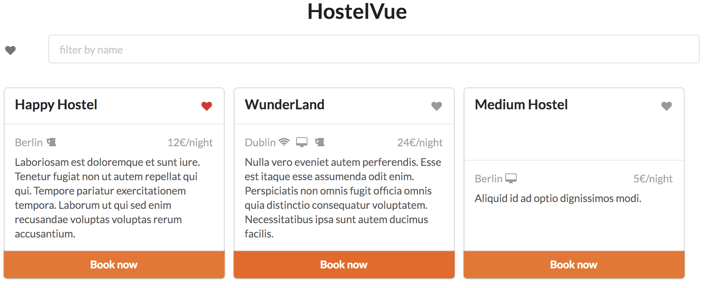
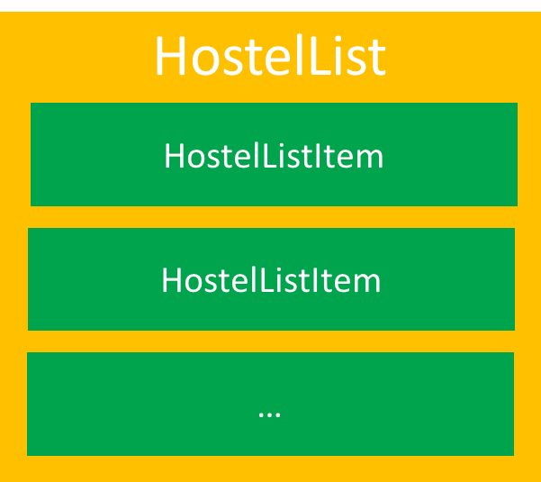

# Part 2: Components

Our final goal is to create something like this:



## Step 1: component separation

Rename the root component into `hostel-list` and create a sub component `hostel-list-item`.
The `hostel-list` should pass to his children an `hostel` property which contain an hostel object.



**Tips!**: 
* To rename the root component, you can use the property name
  ```js
    var app = new Vue({
      el: '#app',
      name: 'hostelList',
      // ...
    })
  ```
* You can use the following structure for your component
  ```js
  Vue.component('hostel-list-item', {
    template: `
      <div class="card">
        <!-- component body here! -->
      </div>
    `,
    props: ['hostel']
  })
  ```


## Step 2: create a like feature


Create a *like* feature. When a user like an hostel, he can click to the heart icon.
Then the `hostel-list-item` should raise an event to his parent.
The parent component have to store the liked hostels.

**Tip!**: 

* HTML template for like icon
  ```html
  <i class="heart icon"></i>
  <i class="red heart icon"></i>
  ```
* You can emit an event like this
  ```js
  <i class="heart icon" @click="$emit('like', hostel)"></i>
  ```
* To listen an event from a parent, use the `v-on`
  ```html
  <hostel-list-item 
    v-for="hostelShown in hostelsShown"
    v-on:like="likeHostel"
  ></hostel-list-item>
  ```
* and then, create the `likeHostel()` function in the parent component
  ```js
const app = new Vue({
  el: '#app',
  name: 'hostelList',
  // ...
  methods: {
    likeHostel (hostel) {
      if (this.likedHostels.indexOf(hostel) === -1) {
        this.likedHostels.push(hostel)
      } else {
        this.likedHostels.splice(this.likedHostels.indexOf(hostel), 1)
      }
    }
  }
})
  ```


## Step 3: create a filter 'liked hostels'

Allow user to list only the liked hostels. The key here is to update the `hostelsShown` computed propety.


**Tip!**: 

* You can use the following HTML code for the form
  ```html
  <form class="ui form">
    <div class="inline fields">
      <div class="one wide field">
        <i :class="onlyShowLiked ? 'red' : 'grey'" class="heart icon" @click="toogleLikeFilter" title="Only show liked hostels"></i>
      </div>
      <div class="fifteen wide field">
        <input type="text" placeholder="filter by name" v-model="userSearch">
      </div>
    </div>
  </form>
  <br>
  ```
* You can update the `hostelsShown` code like the following (don't forget to add and initiate the `onlyShowLiked` value in data)
  ```js
  hostelsShown () {
    const likeFilter = (hostel) => {
      if (this.onlyShowLiked) {
        return this.likedHostels.indexOf(hostel) !== -1
      }
      return true
    }

    return this.hostels
      .filter(likeFilter)
      .filter(hostel => hostel.name.toLowerCase().includes(this.userSearch))
  }
  ```